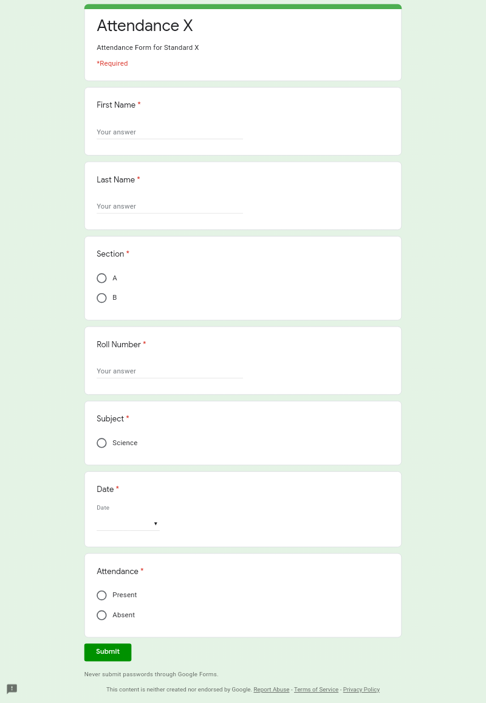

# automated-google-form-filler
A python script to automate Google Forms.

## Introduction
Due to the pandemic, I had online classes where I had to fill Google Form fir attendance each period everyday. This seemed to be a very tedious task for me so I decided to automate it.
This is how my attendance form looked like.

## Things To Remember

- Every Google Form is different and has different fields.So you have to change the parameters in `send_answers()` function as per your needs.
- Some Forms need to submit a reCaptcha before submitting the form. This script won't work for them.
